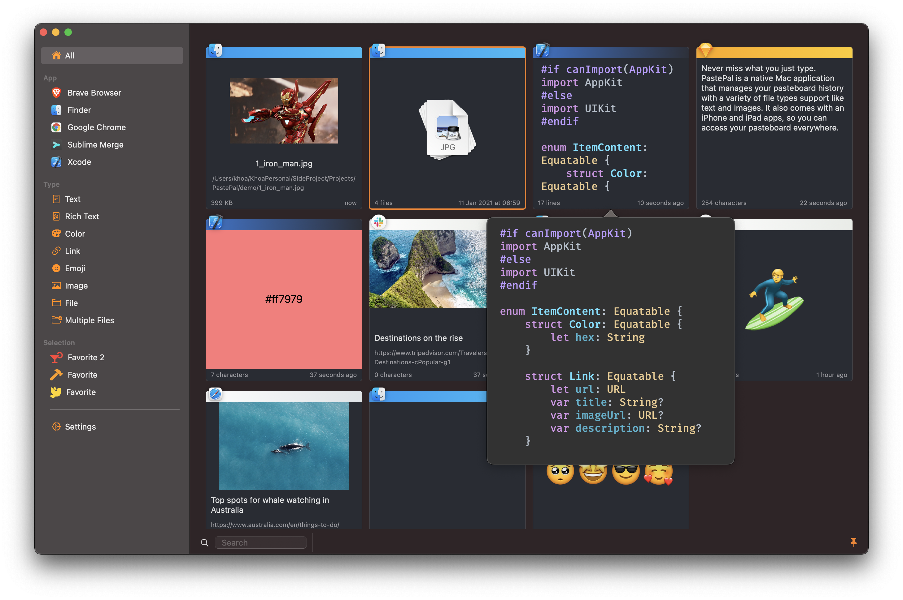

    <h2>PastePal - Clipboard Manager</h2>
    
PastePal is the best universal clipboard manager for Mac, iPhone and iPad.

    
    

  

    <!-- platform -->
    
    
    <!-- social -->
    

 

 

<h1>Features</h1>

- ✅ Native: Written in native AppKit and Swift to embrace the Mac experience. No Catalyst
- ✅ Universal: Universal purchase. Support Mac, iPhone and iPad apps. Sync with iCloud across all your devices
- ✅ No subscription: No recurring subscription. Buy once, use forever. Even for future updates
- ✅ No tracking: No analysis and data collecting. Your data remain locally and safe on your devices.
- ✅ Under your control: Organize pasteboard history the way you want. Specify what and how the history is saved with various settings in the app.
- ✅ Fast: Unlimited history with blazing fast index and search
- ✅ Localization: Localized into over 20+ languages: English, French, Italian, German, Spanish, Polish, Chinese, Russian, Korean, Kurdish, Portuguese, Hungarian, Japanese, Norwegian, ...

 

<h1>Flexible bar</h1>
Access your most recent history at easy with a flexible and unobtrusive bar. Position it wherever you want, either top, left, bottom or right edge of the screen.

 

 

 

- Position: Place it either top, left, bottom or right edge of the screen. You can setup keyboard shortcuts to show and change position.
- Smart detection: Smart detection of copied and pasted item together with its source application
- Context menu: Right click on any history item to access powerful context menu. Copy, delete, add to collection, share, and more.
- Preview: View raw and quick look content withh convenient popover.
- Drag and Drop: Drag one or multiple files, even your newly captured screenshot.
- Descriptive: At a glance, know content type, application, collection, date, how many chracters of each history item.
- Unobtrusive: Show with keyboard shortcut or from menu bar. Dismiss with Esc key or the down arrow button.
- Unpin: During unpin, touch anywhere outside side window to dismiss it.
- Quick Mode: Use same Toggle Side Window shortcut. Press to open side window, hold and keep pressing to navigate among clip items, release to copy or paste
- Queue: Temporary stack to collect, organize and paste all at once
- Peer Share: Even without Handoff or iCloud Sync, you can share content between PastePal apps on local network
- Auto Plain Text: Clear rich text formatting

 

<h1>Omniscient main view</h1>
Filter and search all your history by app, content type, collections.

    
    

 

- Adaptive grid: Automatic resizing grid with adaptive layout
- Quick grouping: Select items by source applications, recognized content type or make your own collections
- Search and pagination: History is paginated for better performance. Use search field at the bottom toolbar to find more.
- Dark mode: Gorgeous light and dark mode themes.
- Fine tune history: Quick toggle to pause and resume pasteboard observation. Control how long your data is preserved.
- Allow and Ignore list: Specify which app, content or folder is allowed or ignored.
- Privacy: Control whether to save passwords and sensitive data.
- Keyboard shortcuts: Setup your own keyboard shortcuts to maximize productivity. Toggle flexible bar, copy, delete, esc and more.

 

<h1>Smart content type</h1>
Recognize common content types and group them for easy access.

 

- Text: Show how many characters and lines for recognized text strings. Preview as Raw.
- Rich Text: Rich formatted texts including code snippets. Preview as Rich Text.
- Hex Color: Detect hex color format like #AABBCC and preview them inline.
- Emoji: Emoji is special. Show it in full scale.
- Link: Show primary thumbnail and page title of a link. Preview as inline browser.
- Image: Image copied from browser or drawing applications. Preview as original size.
- GIF: Preview animated gif
- PDF: Specify treatment for PDF file. Preview as interactable PDF
- File: Show file path and size of copied file. Preview Quick Look representation.
- Multiple Files: Save multiple files as Quick Look and with locations. Preview multiple paths.

 

<h1>Convenient iPhone app</h1>
Still powerful but crafted exclusively for mobile experience
 

 

- Privacy: Honor iOS 14 pasteboard privacy policy. No automatic pasteboard observation, but you can manually insert item into history.
- Smart content type: Recognize common content types like text, link, emoji and hex colors. More will be supported.
- iCloud Sync: By default, sync is disabled so you can use like separate apps. But iCloud Sync can be enabled in Settings.
- Share sheet extension: Share any text content easily to PastePal.
- Action extension: Quick action in Share sheet to add to PastePal
- Quick Action: Long press on PastePal icon in Home screen to access Quick Actions
- Siri Shortcut: Siri suggestions to Add to PastePal
- Widget: iOS 14 Widgets to quickly copy
- Fabulous icons: Choose from well crafted alternate app icons
- App Shortcuts: Support iOS 16 app shortcuts
- Dark mode: Gorgeous light and dark mode themes.

 

<h1>Look great on iPad</h1>
The same Mac experience you used to love, with gorgeous sidebar and grid view.
 
 

     

 

- Any screen orientation: Adapative layout for both landscape and portrait mode.
- Context menu: Force touch on any history item to access powerful context menu. Copy, delete, add to collection, share, and more.

 

<h1>Credit</h1>

PastePal is here today thanks to all your constant support and feedback ❤️

Special thanks

App icon design 

- Yannick Lung

Translations

- Pierre-Henri Guillot 🇫🇷
- qiyuanshouji 🇨🇳
- Albert Abdilim 🇨🇳
- Kevinn 🇭🇰
- Stephen 🇹🇼
- Mateusz Zając 🇵🇱
- Pavel Tuzov 🇷🇺
- Anton Gubarenko 🇷🇺
- Yannick Lung 🇩🇪
- Thomas Wölk 🇩🇪
- Makwan Barzan 🇮🇶
- Joan González 🇪🇸
- Erick Vavretchek 🇧🇷
- James 🇰🇷
- Dylan 🇮🇹
- Tibor Bödecs 🇭🇺
- Donny Wals 🇳🇱
- Marco Janssen 🇳🇱
- Konstantin 🇧🇬
- Tallak Lippe 🇳🇴
- Nurkamol Vakhidov 🇺🇿
- Saffet Emin Reisoğlu 🇹🇷
- Cristi Lupu 🇷🇴
- Nurkamol Vakhidov 🇺🇿
- Roman Mirzoyan 🇺🇦
- Marek Kanaš 🇸🇰
- Minh Hoang Nguyen 🇯🇵

 

<h1>Support</h1>

- Have a problem? Please open a GitHub issue
- Visit homepage https://onmyway133.com/pastepal/ for more information
- Check out https://twitter.com/PastePalApp for feature update demo

PastePal is done by a single indie developer and your support helps keep the project going. Thanks for checking out and have a nice day 😇